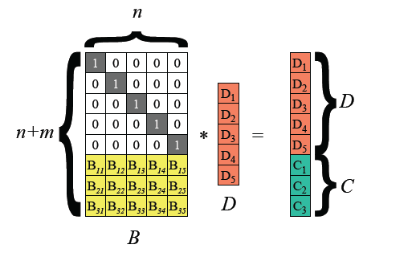

# **纠删码——Reed-Solomon 编码**

### Edited by 牛午甲

## 纠删码简介

纠删码（Erasure Code）是一种编码技术。它通过计算将 n 份原始数据增加至 n+m 份数据，并能由其中的任意 n 份数据还原出原始数据，即可以容忍不多于 m 份的数据失效。纠删码可以应用于分布式存储系统中，替代多份数据拷贝的数据冗余方式，从而可以提高存储空间利用率。此外， 纠删码还可以应用于传统RAID系统中，增加数据冗余度，支持多块盘同时发生故障，从而可以提高数据可靠性；纠删码应用在网络传输中，用以提高存储系统的可靠性。相比多副本复制而言，它能以更小的数据冗余度获得更高数据可靠性， 但编码方式较复杂，需要大量计算。

## 数学基础

**定义1**  如果有限域$F_q$ 上的$m$阶多项式$p(x)=p_0+p_1x+...+p_{m-1}x^{m-1}+x^m$不能被$F_q$上的任意多项式整除，称$p(x)$为不可约多项式。

**定义2**  $F_{q^m}$的本原元在$F_q$上的极小多项式称为$F_q$上的**本原多项式**。

> **Remark：** 
> 
> * 在环论中, 本原多项式定义为各项系数的最大公约数等于1的多项式, 与这里的定义不同.
> 
> * 本原元类似循环群中的生成元.
> 
> * 极小多项式即为次数最低的多项式.
> 
> * $F_q$上的$m$次本原多项式就是$F_q$上的首一不可约多项式, 且有一个根$\alpha\in F_{q^m}$生成了$F_q$的乘法群.

**定义2'**  如果有限域$F_q$ 上的不可约多项式$p(x)=p_0+p_1x+...+p_{m-1}x^{m-1}+x^m$能够整除$x^n-1$的$n$的最小整数取值为$n=q^m-1$，称$p(x)$为$F_q$上的本原多项式。

$char\ F=2$的本原多项式：

**Remark：** 一个$m$并不是只对应一个本原多项式，想查询更多的本原多项式可以使用[本原多项式查询工具](https://wims.univ-cotedazur.fr/wims/cn_tool~algebra~primpoly.cn.html)

**定理1** $\ $若$F$ 为有限域，则$F$的特征为某个素数$p$，并且它是$p$元域$F_p$的有限扩张。令$n=[F:F_p]$，则$F$中共有$p^n$个元素。$^{[1]}$

#### $Extension\ Field\ $ 的生成$^{[2]}$

对于素数域$F_p=\left\{ 0,1,2,...,p-1,p\right\}$ 上的本原多项式$p(x)=p_0+p_1x+...+p_{m-1}x^{m-1}+x^m$，考察它的根。由本原多项式的定义可知，$p(x)$在素数域上是不可约的，因此 $p(x)$的根不可能在素数域 $F_p$上找到，它们存在于一个更大的域中。下面寻找这个域：

假设α是$p(x)=0$的一个根，那么我们有：$p_0+p_1\alpha+...+p_{m-1}\alpha^{m-1}+\alpha^m=0$,

根据本原多项式的定义（定义2’），$p(x)\mid x^{p^m-1}-1$。

由$Bezout$定理，$\alpha^{p^m-1}-1=0$，即$\alpha^{p^m-1}=1$，由$n=p^m-1$的最小性（定义2‘）可知$\alpha$的阶为$p^m-1$。

因此可以构造$\alpha$ 生成的集合$F=\left\{0,1,\alpha ,\alpha ^2,...,\alpha^{p^m-2}\right\}$ ，定义$F$中的乘法运算：$\alpha^i\cdot\alpha^j=\alpha^{i+j}=\alpha^{(p^m-1)+r}=\alpha^{p^m-1}\cdot\alpha^r=1\cdot\alpha^r=\alpha^r$，进而可以定义多项式带余除法：$x^i=q(x)\cdot p(x)+a_i(x)$，由于$deg\ p(x)=m$，所以$deg\ a_i(x)\lt m$，$x$用$\alpha$带入，有$\alpha^i=a_i(\alpha)=a_0+a_1\alpha+...+a_{m-1}\alpha^{m-1}$。

因此，**任意一个$\alpha$的幂次方都可以表示成至多$m-1$阶的$\alpha$多项式**。根据这一结论，定义$F$中的加法运算：

$\alpha^i+\alpha^j=(a_{i,0}+a_{i,1}\alpha+...+a_{i,m-1}\alpha^{m-1})+(a_{j,0}+a_{j,1}\alpha+...+a_{j,m-1}\alpha^{m-1})$

  $=(a_{i,0}+a_{j,0})+(a_{i,1}+a_{j,1})\alpha +...+(a_{i,m-1}+a_{j,m-1})\alpha^{m-1}$（注：上面的加法是模$p$意义下的加法）

可以证明，$F$集合构成了一个具有$p^m$个元素的域，用符号$F_{p^m}$表示，$F_{p^m}$称为$F_p$的扩展域。

$GF({2^5})$中的元素构成及表示：

## **Reed-Solomon Code**$^{[3]}$

RS code是基于有限域的一种编码算法，有限域又称为$Galois\ Field$，是以法国著名数学家伽罗华（$Galois$）命名的，在RS code中使用$GF(2^w)$，其中$2^w \geq n + m$。

RS code的编解码定义如下：  

**编码：** 给定n个数据块（$Data\ block$）$D_1,D_2,...,D_n$，和一个正整数$m$，RS根据$n$个数据块生成$m$个编码块（$Code\ block$）$C_1,C_2,...,C_m$。

**解码：** 对于任意的$n$和$m$，从$n$个原始数据块和$m$个编码块中任取$n$块就能解码出原始数据，即RS最多容忍$m$个数据块或者编码块同时丢失。

RS编解码中涉及到矩阵求逆，采用高斯消元法，需要进行实数加减乘除四则运算，无法作用于字长为$w$的二进制数据。为了解决这个问题， RS采用伽罗华域$GF(2^w)$中定义的四则运算法则。$GF(2^w)$域有$2^w$个元素， 每个元素都对应一个低于w次的多项式， 这样域上的四则运算就转换为多项式空间的运算。  $GF(2^w)$域中的加法就是XOR， 乘法通过查表实现，需要维护两个大小为$2^w -1$的表格: log表$gflog$，反log表$gfilog$。 

**乘法公式：** $a \cdot b = gfilog(gflog(a) + gflog(b)) % (2^w -1)$ $^{[4]}$

## RS Code编解码原理

#### 编码

RS 编码以 word 为编码和解码单位，大的数据块拆分到字长为 w（取值一般为 8 或者 16 位）的 word，然后对 word 进行编解码。把输入数据视为向量$(D_1,D_2,...,D_n)$ ，编码后数据视为向量$(D_1,D_2,...,,D_n,C_1,C_2,...,C_m)$，RS 编码可视为如下图所示矩阵运算。

> **Remark：** 每个分量$C_i,D_i$代表一个word。

上图最左边是编码矩阵（或称为生成矩阵、分布矩阵，Distribution Matrix），编码矩阵需要满足任意$n$级子方阵可逆。为方便数据存储，编码矩阵上部是单位阵，下部是 m\*n 矩阵。下部矩阵可以选择范德蒙德矩阵或柯西矩阵。

#### 解码（数据恢复）

RS 最多能容忍数据块+校验块共m 块缺失，数据恢复的过程如下：

1. 假设 D1、D4、C2 丢失，从编码矩阵中删掉丢失的数据块/校验块对应的行。
   
   
   
   根据 RS 编码运算等式，可以得到 B' 以及等式：
   
   

2. 由于 B' 是可逆的，记 B' 的逆矩阵为 $B'^{-1}$，则$B'*B'^{-1} = I$单位矩阵。两边左乘 $B'^{-1}$：
   
   

3. 得到如下原始数据 D 的计算公式：
   
   
   
   从而恢复原始数据 D：
   
   

> **RS code编码的限制**
> 
> 1）数据恢复代价高和数据更新代价高，因此常常针对只读数据，或者冷数据。
> 
> 2）RS编码依赖于两个$2^w-1$大小的log表， 通常只能采用16位或者8位字长，不能充分利用64位服务器的计算能力， 具体实现上可能要做一些优化。

## 编码矩阵

#### 基于范德蒙德（Vandermonde）矩阵

一个 m 行 n 列的范德蒙德矩阵定义如下，其中$a_i$均不相同，且不为 0。容易证明它的任意的子方阵均为可逆方阵。

令$a_1,a_2,...a_n$分别为 1, 2, 3, ..., n，则得到范德蒙德矩阵如下：

编码矩阵就是单位矩阵和范德蒙德矩阵的组合。 编码矩阵和输入数据D的乘积就是编码后的数据。

采用这种方法的算法复杂度比较高，编码复杂度为 $O(mn)$，其中 m 为校验数据个数，n 为输入数据个数。解码复杂度为$O(n^3)$。

#### 基于柯西（Cauchy）矩阵

柯西矩阵定义如下：

柯西矩阵的任意一个子方阵都是奇异矩阵，存在逆矩阵$^{[5]}$。使用柯西矩阵，相对范德蒙德矩阵的优化主要有两点：

- 降低了矩阵求逆的运算复杂度。范德蒙矩阵求逆运算的复杂度为 $O(n^3)$，而柯西矩阵求逆运算的复杂度仅为 $O(n^2)$。
- 通过有限域转换，将 $GF(2^w)$ 域中的元素转换成二进制矩阵，将乘法转换为逻辑与，降低了乘法运算复杂度。（二进制的加法即 XOR，乘法即 AND）

基于柯西矩阵的编码矩阵如下，其中$x_i$ 和 $y_i$ 都是伽罗华域 $GF(2^w)$中的元素：

#### 柯西编解码过程优化

在基于范德蒙矩阵的编码中，我们可以采用对数、反对数表的方法，将乘法运算转换成了加法运算，并且在伽罗华域中，加法运算转换成了 XOR 运算。

柯西编解码为了降低乘法复杂度，采用了**有限域上的元素都可以使用二进制矩阵表示**的原理，将乘法运算和加法运算分别转换成了伽罗华域上AND 运算和XOR 运算，提高了编解码效率。

从数学的角度，在迦罗华有限域中，任何一个$F_{2^w}$上的元素都可以映射到 $F_{2}^{w\times w}$，即可以采用一个二进制矩阵的方式表示 $GF(2^w)$ 中的元素。例如 $GF(2^3)$ 域中的元素可以表示成 $GF(2)$ 域中的二进制矩阵：

上图中，黑色方块表示逻辑 1，白色方块表示逻辑 0。

---

**关于上例的生成过程**

由于上例是对$GF(2^3)$中的元素作转换，结合前面数学基础部分的介绍，先找到$F_2[x]$中的一个三次本原多项式$x^3+x+1$。则根据扩展域生成的推导过程可知，$GF(2^3)$中所有元素都可以表示为关于$\alpha$的、次数不超过2的多项式，其中$\alpha$是本原多项式的根。对$GF(2^3)$中所有元素作多项式带余除法（即$mod\ x^3+x+1$）：

| 幂次形式       | 余数形式                | 二进制形式 | 十进制形式 |
|:----------:|:-------------------:|:-----:|:-----:|
| 0          | 0                   | 000   | 0     |
| 1          | 1                   | 001   | 1     |
| $\alpha$   | $\alpha$            | 010   | 2     |
| $\alpha^2$ | $\alpha^2$          | 100   | 4     |
| $\alpha^3$ | $\alpha+1$          | 011   | 3     |
| $\alpha^4$ | $\alpha^2+\alpha$   | 110   | 6     |
| $\alpha^5$ | $\alpha^2+\alpha+1$ | 111   | 7     |
| $\alpha^6$ | $\alpha^2+1$        | 101   | 5     |

选定0、1、2所对应的二进制矩阵作为一组基，由于$4=2\times 2$，通过矩阵乘运算可以得到4对应的矩阵，再通过XOR运算立即得到其他元素对应的矩阵。

**Remark：**

- 0和1作为零元和幺元，所对应的矩阵必须是全零矩阵和单位阵；生成元$\alpha$所对应的矩阵$A$必须满足$p(A)=0$，其中$p(x)$是选定的本原多项式（多项式环通用性质：$x$用$A$带入）。

- 当一个$m$对应有多个本原多项式时，**选取不同的本原多项式会导致$GF(2^w)$中元素的幂次形式到余数形式的映射的改变，但是映射仍然是双射**。

- **幂次形式和余数形式才是域中元素的真实形式，二进制形式可以理解成向量，十进制形式仅仅相当于标号，计算乘法、加法时没有实际意义**。

---

通过这种转换，$GF(2^w)$域中的矩阵就可以转换成 $GF(2)$ 域中的二进制矩阵。生成矩阵的阵列转换表示如下：

在 $GF(2^w)$ 域中的编码矩阵为 $F_{2^w}^{k\times (k+m)}$，转换到 $GF(2)$ 域中，使用二进制矩阵表示，编码矩阵变成了 $F_2^{wk\times w(k+m)}$ 二进制矩阵。采用域转换的目的是简化$GF(2^w)$ 域中的乘法运算。在$GF(2)$域中，乘法运算变成了AND运算，加法运算变成了XOR运算，可以大大降低运算复杂度。

和基于范德蒙矩阵的编解码中可能使用的对数/反对数方法相比，基于柯西矩阵的编解码**不需要构建对数或反对数表**，可以支持 $w$ 为很大的伽罗华域空间。采用这种有限域转换的方法之后，柯西编码运算可以表示如下：

使用柯西矩阵要优于范德蒙德矩阵的方法，柯西矩阵的运算复杂度为 $O(n\cdot(n-m))$，解码复杂度为 $O(n^2)$。

## 小结

RS  Code简单来说就是构造一个双射$\varphi:GF(2^w)\to F_2^{w\times w} $ ，将一个数据块（1Byte或1half-word）变成二进制矩阵，再执行上述算法生成编码块，进行存储、维护，需要还原为数据的时候再将$\varphi^{-1}$作用在二进制矩阵上即可。

## 参考文献

[1]近世代数引论（第4版）冯克勤、李尚志、章璞编著.

[2][信道编码系列(三)：伽罗华域(Galois Fields)](https://zhuanlan.zhihu.com/p/161411524)

[3][Erasure Code - EC纠删码原理](https://www.cxymm.net/article/shelldon/54144730)

[4][RS（纠删码）技术浅析及Python实现](https://www.cnblogs.com/zhenlingcn/p/10366644.html)

[5][Cauchy行列式与类似Hilbert矩阵的逆矩阵](https://zhuanlan.zhihu.com/p/111537288)
