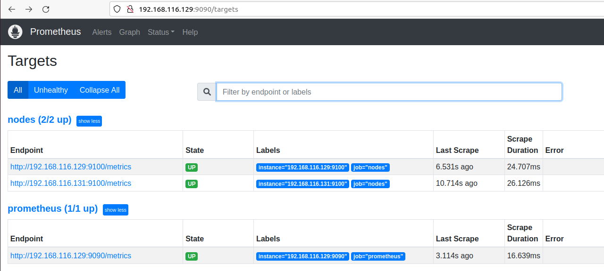
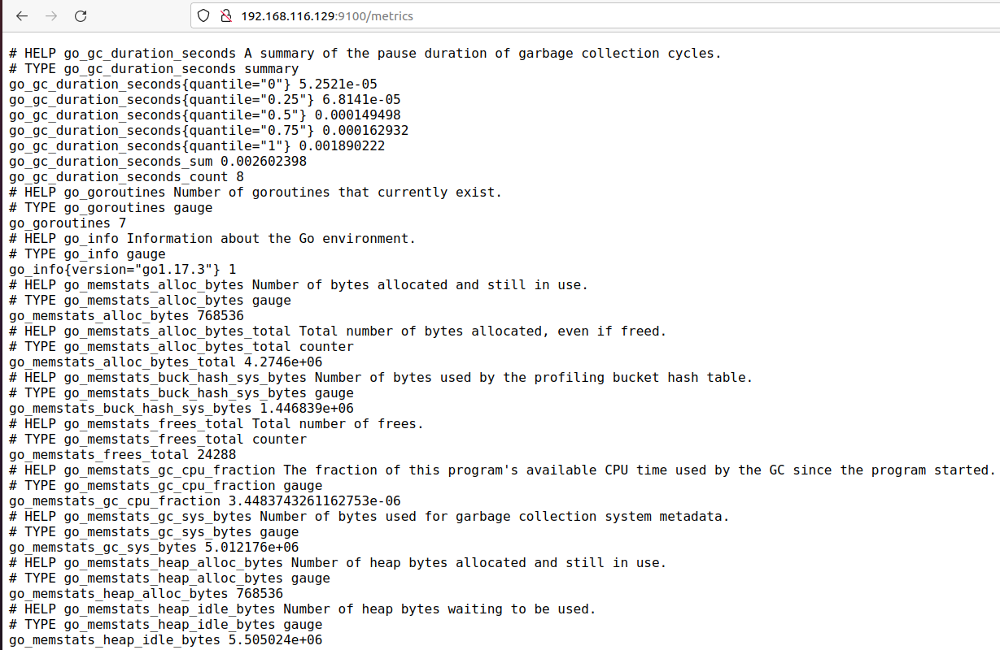
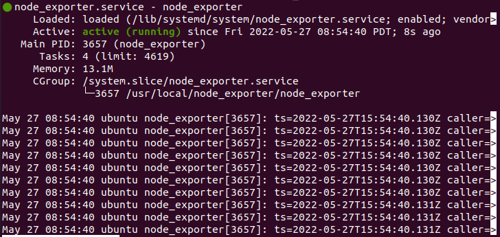

# Prometheus部署文档

[参考部署文档](https://blog.51cto.com/u_12082223/3241875)

## Server端

### 安装Prometheus

**Step1：** 到[官网](https://prometheus.io/download/)下载prometheus

**Step2：** 解压

```shell
tar -zxvf prometheus-2.35.0.linux-amd64.tar.gz
```

**Step3：** 修改配置文件

```shell
cd prometheus-2.35.0.linux-amd64/
vim prometheus.yml
```

将localhost改为Server端的IP，**默认端口9090**

**Remark：** **不要用用户名代替IP**，否则后面在线状态会一直显示down！


如果使用pushgateway（网关）主动拉取消息，在上述配置文件最后添加以下内容：

```vim
  - job_name: 'pushgateway'
    static_configs:
      - targets: ['192.168.116.129:9091']
```

如果使用node_exporter，在上述配置文件最后添加以下内容：

```vim
  - job_name: 'nodes'
    static_configs:
      - targets: ['192.168.116.129:9100','192.168.116.131:9100']
```

**注意：** 

* 严格遵从上面的格式，否则可能配置失败！

* IP均不要用user名替代！

保存并退出。

**Step4：** 尝试启动

```shell
./node_exporter
```

保持终端，到网页访问`http://192.168.116.129:9090/targets`，若显示当前Server及Client在线状态说明运行成功：



**Step5：** 设置prometheus系统服务,并配置开机启动

[prometheus、node_exporter设置开机自启动 - 葛老头 - 博客园](https://www.cnblogs.com/gltou/p/15153878.html)

```shell
sudo cp -R prometheus-2.35.0.linux-amd64 /usr/local/prometheus
cd /usr/local/prometheus
vim prometheus.yml
```

**Remark：** prometheus.yml配置文件如果在前面修改过，这里就不用再修改。

```shell
sudo touch /usr/lib/systemd/system/prometheus.service
sudo vim /usr/lib/systemd/system/prometheus.service
```

将如下配置写入prometheus.service

```vim
[Unit]
Description=prometheus
After=network.target
[Service]
Type=simple
ExecStart=/usr/local/prometheus/prometheus --config.file=/usr/local/prometheus/prometheus.yml --storage.tsdb.path=/usr/local/prometheus/data 
Restart=on-failure
[Install]
WantedBy=multi-user.target
```

**Remark：** 由于没有创建prometheus组合用户，故Service的User就不用写！否则会自启动失败。

设置开机启动

```shell
systemctl daemon-reload
systemctl enable prometheus.service
systemctl start prometheus.service
systemctl status prometheus.service
```

出现如下显示说明成功：


保持终端，到网页访问`http://192.168.116.129:9090/targets`，若显示当前Server及Client在线状态说明运行成功：


## Client端

### 安装Node_exporter

**Step1：** 到[官网](https://prometheus.io/download/)下载node_exporter

**Remark：** 客户端不支持Windows，只支持Linux和Mac。

**Step2：** 解压

```shell
tar -zxvf node_exporter-1.3.1.linux-amd64.tar.gz
```

**Step3：** 尝试运行

```shell
cd node_exporter-1.3.1.linux-amd64/
./node_exporter
```

保持终端，到网页访问`http://192.168.116.129:9100/metrics`，若显示当前 node_exporter 获取到的当前主机的所有监控数据说明运行成功：



**Remark：** 

* 访问网页时IP改为自己当前主机IP

* **不能用自己主机当前用户名代替IP，可能会失败！**

---

若出现端口被占用`listen tcp :9100: bind: address already in use`，则按照如下步骤处理，否则跳过此部分：

切换到root用户：

```shell
sudo su
```

查看9100端口对应的进程：

```shell
netstat -nap | grep 9100
```

**Remark：** 

* [linux端口号与PID的互相查询 - Hosens - 博客园](https://www.cnblogs.com/understander/p/5546458.html)

* 若不知道端口号，可以用以下命令查询当前系统下所运行的所有端口情况：
  
  ```shell
  sudo netstat -antup
  ```

kill当前9100端口对应进程：

```shell
kill <process_id>
```

重新启动node_exporter即可。

---

**Step4：** 启动 node_exporter 服务并设置开机启动

```shell
sudo cp -R node_exporter-1.3.1.linux-amd64 /usr/local/node_exporter
cd /usr/local/node_exporter
sudo touch /usr/lib/systemd/system/node_exporter.service 
sudo vim /usr/lib/systemd/system/node_exporter.service
```

**Remark：**

- cp    -r：若给出的源文件是一个目录文件，此时将复制该目录下所有的子目录和文件。

在node_exporter.service中加入如下代码：

```vim
[Unit]
Description=node_exporter
After=network.target
[Service]
Type=simple
User=root
ExecStart=/usr/local/node_exporter/node_exporter
Restart=on-failure
[Install]
WantedBy=multi-user.target
```

保存并退出。

启动 node_exporter 服务并设置开机启动：

```shell
systemctl daemon-reload
systemctl enable node_exporter.service
systemctl start node_exporter.service
systemctl status node_exporter.service
```

出现如下显示说明成功：



保持终端，到网页访问`http://192.168.116.131:9100/metrics`，若显示当前 node_exporter 获取到的当前主机的所有监控数据说明运行成功：


### 安装Pushgateway（暂不需要）

**Step1：** 到[官网](https://prometheus.io/download/)下载Pushgateway

**Step2：** 解压

```shell
tar -zxvf pushgateway-1.4.2.linux-amd64.tar.gz
```

Remark：

* pushgateway没有配置文件，到目录下找到可执行文件说明安装成功

* pushgateway可以安装在client端也可以安装在server端

## 使用InfluxDB
